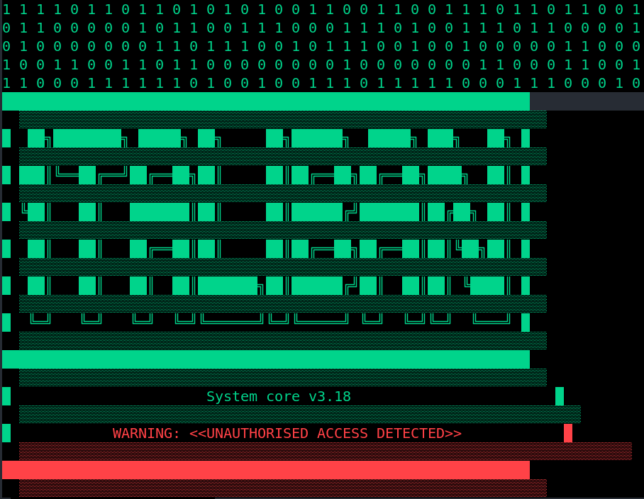
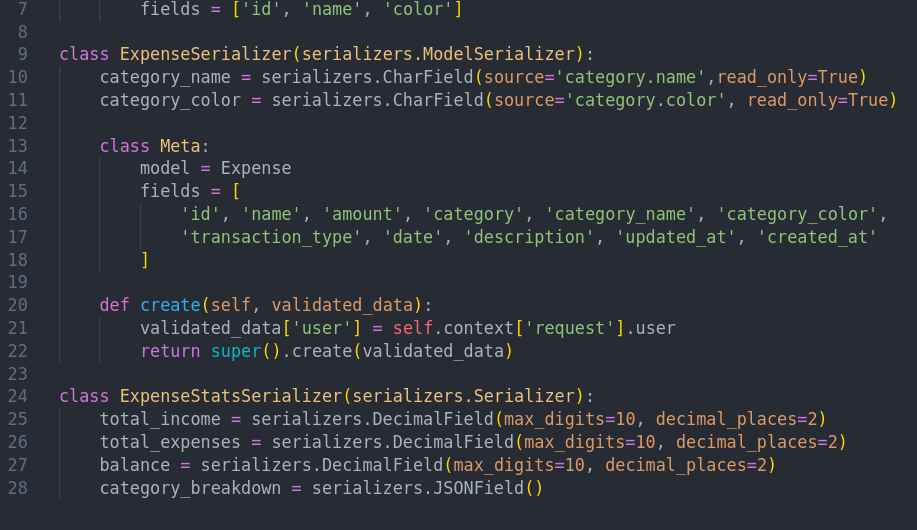
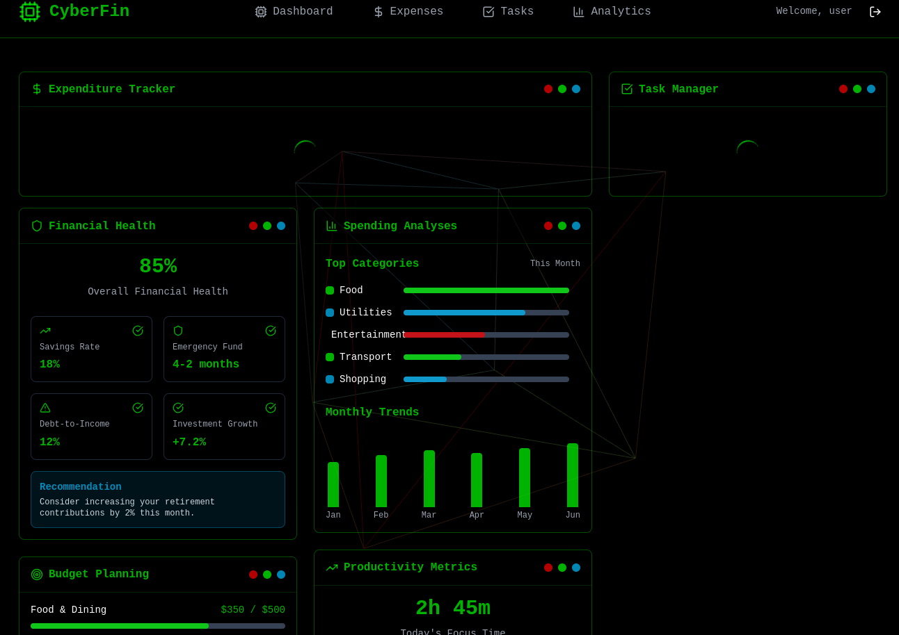
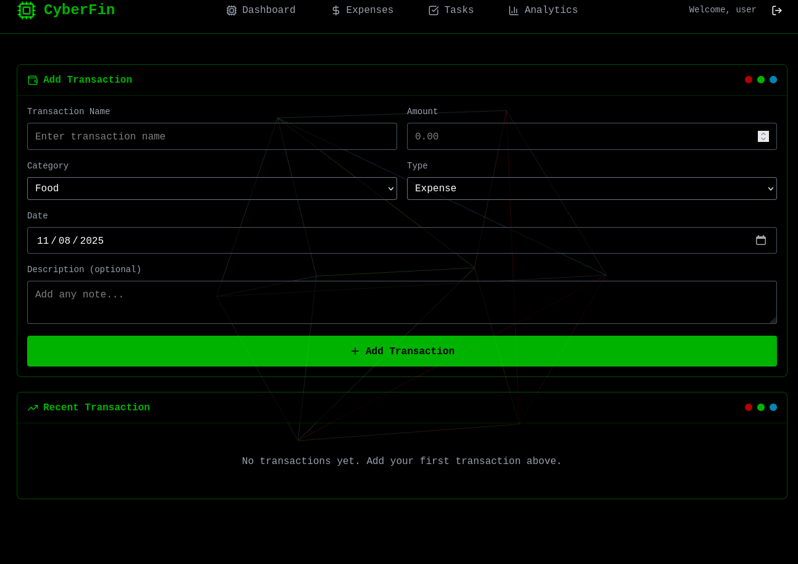
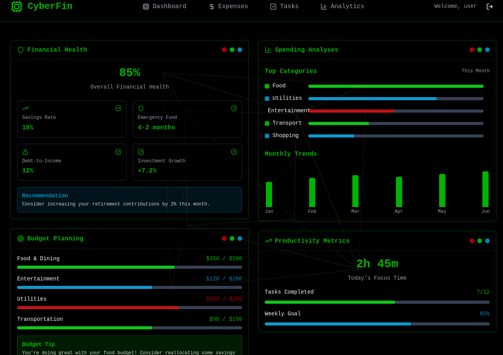

# CYBERFIN EXPENDITURE, FINANCIAL TRACKER AND TASK MANAGER

**Manage your expenses with this tool with robust integrated terminal modals**

*CyberFin is a hacker like themed web app that makes it possible to track your expenses on terminal like window. Cool color designs have been implemented to make you feel a hacker, ethical one of course. The tool is capable of giving analytics regarding your expenditure. I preferrably ought to populate the fields with mock data so as to show the tool capabilities. Nice visualization has been implemented , graphs and lines , give visual interpratetion of the data. There is a task manager to manage your tasks efficiently with a clear record. Make full use of the tool to gear up your productivity.*

## Backend

## Frontend

**CyberFin capture Dashboard**

**Expense UI**

**Analytics page**

